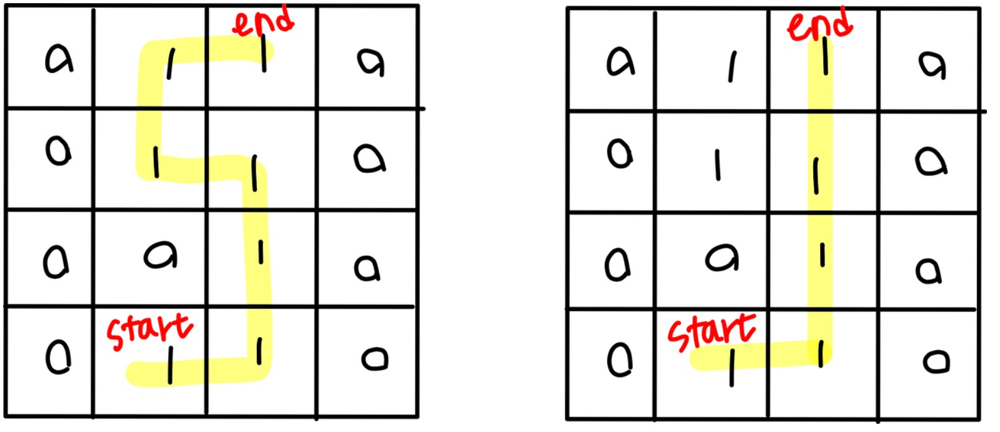
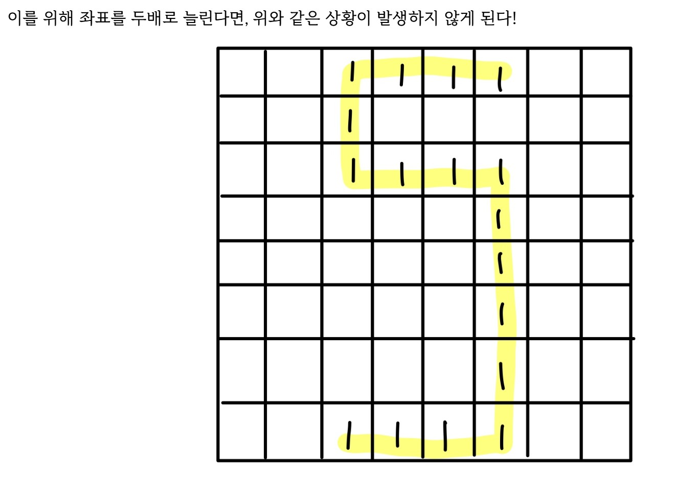

### 문제링크: https://school.programmers.co.kr/learn/courses/30/lessons/87694

# 접근 방식
bfs 로 탐색하되 겹쳐진 사각형의 테두리들로만 움직여 최단거리를 구하도록 코드를 구성하였다. 

</br>
</br>

# 학습내용
사각형들이 바로 인접하게 테두리가 있는 경우 그 곳을 카운트 하지 않고 지나가는 문제를 해결하지 못해 다른 사람의 풀이를 참고했다. 
예를 들어 

는 왼쪽처럼 가는게 정답인데 자꾸 오른쪽으로 가졌다. 그래서 한참 고민하다가 다른 분 풀이를 참고했더니 

처럼 길이를 * 2 해주면 된다는 사실을 알게 되어 그렇게 했다. 
</br>
</br>

# 풀이 코드

```

def solution(rectangle, characterX, characterY, itemX, itemY):
    answer = 0
    lg = 51
    check = [[-1]* lg * 2 for row in range(lg * 2)]
    v = [[(0,0)] * lg * 2 for row in range(lg * 2)]
    for i in range(len(rectangle)):
        sx, sy, ex, ey = map(lambda x: x *2, rectangle[i])
        for x in range(sx, ex + 1):
            for y in range(sy, ey +1):
                if sx < x < ex and sy < y < ey:
                    check[x][y] = 0
                elif check[x][y] != 0:
                    check[x][y] = 1

    que = [(characterX * 2, characterY * 2, 0)]
    v[characterX * 2][characterY * 2] = (1,0)
    dr = [(-1, 0), (1, 0), (0, -1), (0, 1)]
    while que:
        cr, cc, m = que.pop(0)
        if cr == itemX * 2 and cc == itemY * 2:
            if not answer:
                answer = m // 2
            elif answer and answer > m // 2 :
                answer = m // 2
        for k in range(4):
            nr, nc = cr + dr[k][0], cc + dr[k][1]
            if 0 < nr < lg * 2  and 0 < nc < lg * 2 and check[nr][nc] == 1:
                if not v[nr][nc][0]:
                    v[nr][nc] = (1, m + 1)
                    que.append((nr,nc,m+1))
                elif v[nr][nc][0] and v[nr][nc][1] > m + 1:
                    v[nr][nc] = (1, m + 1)
                    que.append((nr,nc,m+1))

    return answer
```